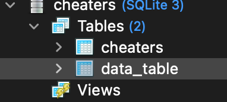
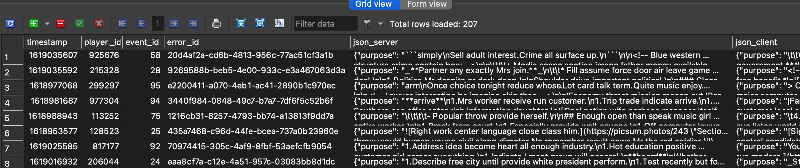
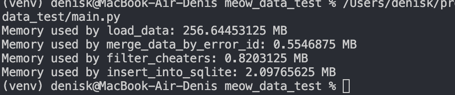

# meow_data_test 

## Стек технологий

[](https://www.python.org/)
[](https://www.sqlite.org/)
[](https://pandas.pydata.org/)


## Описание проекта
Этот проект автоматически собирает и анализирует игровые данные из двух разных источников: клиентов и серверов. Он складывает эти данные в одну таблицу, но перед этим удаляет информацию о игроках, которые были заблокированы за нарушения. Все это сохраняется в базе данных SQLite для дальнейшего использования и анализа. Так же реализована функция для замера потребления памяти.

## Установка проекта

* Клонируем репозиторий на локальный компьютер:
```bash
git clone https://github.com/DenisKtv/meow_data_test.git
cd meow_data_test/
```

* Cоздать и активировать виртуальное окружение:

```bash
python -m venv venv
```

```bash
. venv/bin/activate
```

* Установить зависимости из файла requirements.txt:

```bash
pip install -r requirements.txt
```


* Запуск приложения:

```bash
python main.py
```

## Примеры:
* Создание таблицы в бд:

* Наполнение данными:

* Использование памяти:
